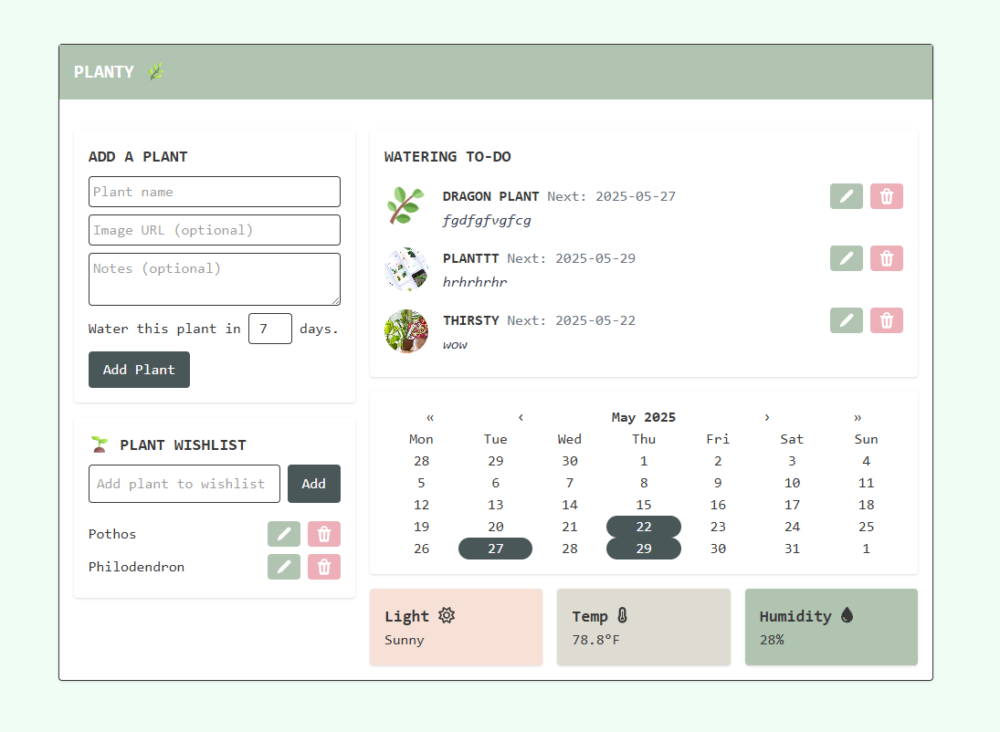

# Planty 🌱

**Planty** is a React-based application designed to help users manage their plants. It allows users to track watering schedules, maintain a wishlist of plants, and view a calendar highlighting watering dates.

---

## Features

- **Add Plants**: Add plants with details such as name, watering frequency, last watered date, optional image, and notes.
- **Watering Schedule**: Automatically calculate and display the next watering date for each plant.
- **Calendar Integration**: Highlights dates on a calendar when plants need watering.
- **Edit and Delete Plants**: Update plant details or remove plants from the list.
- **Wishlist**: Maintain a wishlist of plants you want to add to your collection.
- **Local Storage**: Persist plant and wishlist data across browser sessions.

---

## Screenshot

